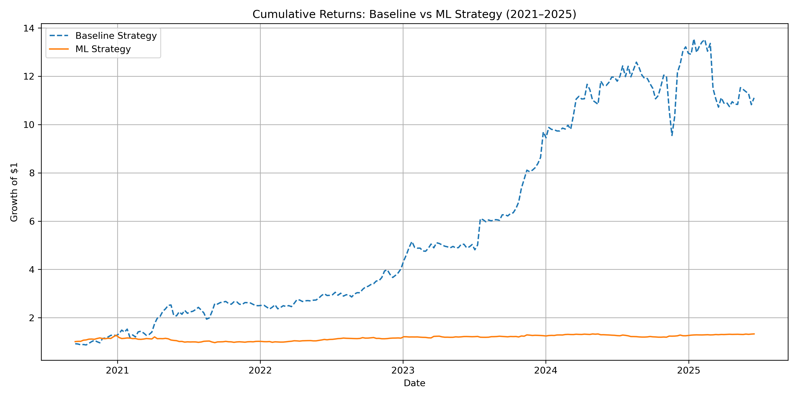

# Machine Learning Momentum Strategy on Crypto Assets

  

## Overview

This project implements and compares a traditional momentum-based strategy and a machine learning-based forecast model on four major cryptocurrencies: BTC, ETH, SOL, and XRP. It simulates realistic weekly rebalancing, long/short portfolio construction, and risk management using Value-at-Risk (VaR) with Monte Carlo simulations.

Built with:
- Python (ccxt, pandas, numpy, matplotlib, xgboost)
- Backtesting via vectorized logic
- Risk analysis inspired by Monte Carlo methods

## Goals

- Predict next-week returns using technical indicators
- Apply supervised ML (XGBoost) to rank and rebalance assets
- Evaluate performance with Sharpe, Sortino, Drawdown
- Conduct Monte Carlo VaR analysis for portfolio-level risk
- Compare against a classic rule-based momentum strategy

## Strategy Performance (2021–2025)

| Metric           | Baseline Strategy | ML Strategy     |
|------------------|-------------------|-----------------|
| CAGR             | 64.3%             | 6.17%           |
| Sharpe Ratio     | 1.32              | 1.23            |
| Sortino Ratio    | 1.84              | 1.75            |
| Max Drawdown     | -28.1%            | -24.0%          |

## Strategy Comparison

The baseline strategy produced strong returns but came with large volatility and drawdowns. The ML strategy delivered more modest returns but with greater consistency, reinforcing its potential role in capital preservation or hybrid systems.

## Risk Analysis

- **95% Monte Carlo VaR:** -2.63% daily
- **Historical VaR:** -2.43%
- **Parametric VaR:** 2.85% (not reliable in crypto)

Monte Carlo simulations better reflected tail risk behavior in volatile markets like crypto.

## Advanced Enhancements (Planned)

- Feature selection via clustering
- Walk-forward model retraining
- Meta-labeling for signal confidence
- Deflated Sharpe Ratio (per López de Prado)

## Author

Built by Jasveer Govender, a data science and finance professional with a passion for quant strategy research. Connect on [LinkedIn](https://www.linkedin.com/in/jasveergovender/).

---

This project was created as part of a professional transition into the quantitative finance space, with a specific focus on hedge fund applications and institutional-level portfolio research.
